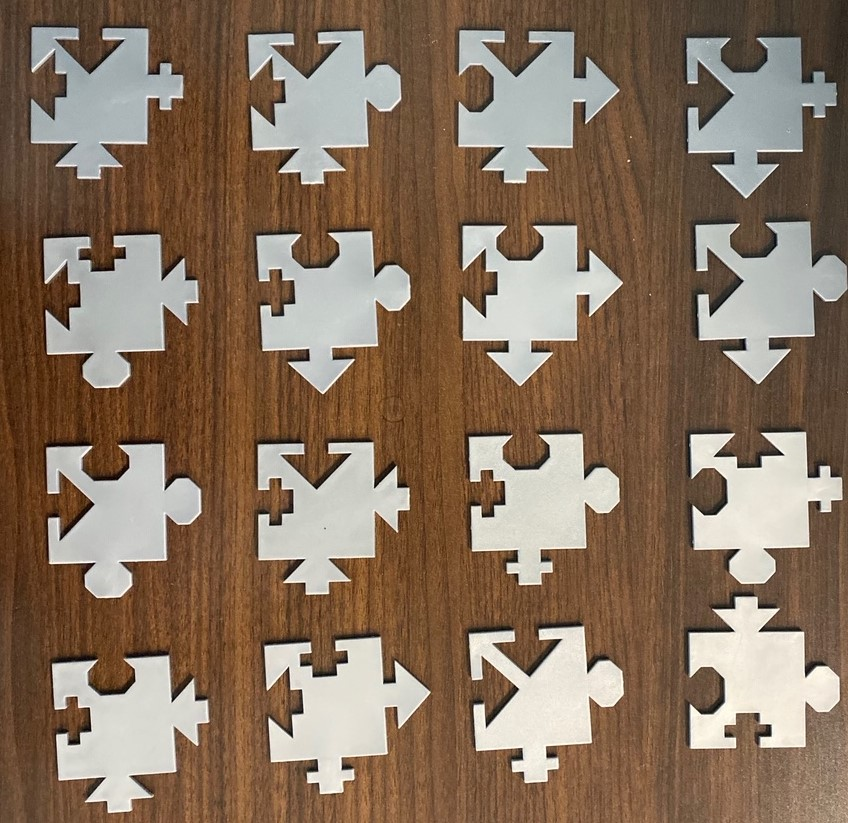

# PuzzleSolver

This is a project that tries to find all possible solutions to the following puzzle:

The task was given for fun by an instructor to attempt to brute force and find all the solutions.

I start by finding all sets of 2.  Then I loop through each set and check if each piece fits together.  If the pieces fit into a 4x4 grid then I save it as a solution.

# How to build:
The Static and Dynamic libraries should already be placed inside of the other projects.  If not open PuzzleSolverAPI and Build Solution.  Release will build a Release DLL for the Unity project and LibExport with build a Release lib for the C++ project

Open the Unity Project with Unity, I created it using version 2019.4.17f1, and hit play.  If all works you should See the pieces of the puzzle on screen and a set up buttons to view the solution.

The C++ project has a single draw function.  This can be changed to show the solutions how ever you want inside of the console window.  In the example I have them print the piece index and how many times it is rotated in order that they appear in the solution.
